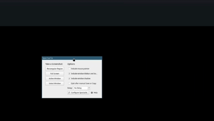

# WayShade

GPU/CPU-accelerated visual effects library for Wayland compositors and clients.
Halide-generated kernels (CPU SIMD + CUDA) behind a stable C ABI, a safe Rust
wrapper, and a `wlr-layer-shell` demo panel that blurs the desktop behind it live.



## Prerequisites

- `build-essential`, `cmake` (≥ 3.22), `ninja-build`, `git`, `pkg-config`
- Halide binary distribution from <https://github.com/halide/Halide/releases> (Linux
  x86_64). Extract to `~/opt/halide` (or anywhere) and export:
  ```bash
  export Halide_DIR=$HOME/opt/halide/lib/cmake/Halide
  export LD_LIBRARY_PATH=$HOME/opt/halide/lib:$LD_LIBRARY_PATH
  ```
- For the Rust crates: a Rust toolchain (rustup) and `libclang` (`libclang-dev` on
  Debian/Ubuntu), which `bindgen` needs to build `fx-sys`.
- For the Wayland demo only: a running `wlr-layer-shell` compositor (Sway, Hyprland,
  or KWin). The `wayshade-panel` crate has no other system dependency.

## Build

```bash
cmake -S . -B build -G Ninja -DCMAKE_BUILD_TYPE=Release
cmake --build build
```

The Halide generators run at build time and emit per-effect headers and static
libraries (`build/halide/fx_gamma.*`, `fx_gaussian_cpu.*`, `fx_gaussian_gpu.*`,
`fx_kawase_cpu.*`, `fx_kawase_gpu.*`, `fx_shadow_cpu.*`, `fx_shadow_gpu.*`,
`fx_color.*`, `fx_rounded.*`), which the `fx_cli` example links against.

## Run the example CLI

```bash
./build/examples/fx_cli/fx_cli <input.png> <output.png> <effects...> [--gpu]
```

Effects apply left-to-right in the order given, so they compose. Run
`fx_cli --list` for the available effects and their parameters, `--help` for usage.

```bash
# Gamma correction. gamma > 1 brightens midtones, < 1 darkens, = 1 is identity.
./build/examples/fx_cli/fx_cli input.png brighter.png --gamma 2.2

# Separable Gaussian blur (sigma in pixels).
./build/examples/fx_cli/fx_cli input.png blurred.png --gaussian --sigma 8

# Dual-Kawase blur (offset scales the radius). The fast, compositor-style blur.
./build/examples/fx_cli/fx_cli input.png blurred.png --kawase --offset 3 --gpu

# Drop shadow. Blurs the alpha, offsets/tints it, composites the source over.
# Only visible where the source is transparent (an icon or sprite, not a photo).
./build/examples/fx_cli/fx_cli icon.png shadowed.png --shadow --sigma 8 --dy 8 --opacity 0.5

# Color correction (brightness, contrast, saturation; 1.0 each is identity).
./build/examples/fx_cli/fx_cli input.png graded.png --color --brightness 1.1 --saturation 1.3

# Rounded-corner mask. Carves the alpha with an antialiased rounded rectangle.
./build/examples/fx_cli/fx_cli icon.png rounded.png --rounded --radius 16

# Blur on the GPU (CUDA), then gamma-correct the result.
./build/examples/fx_cli/fx_cli input.png out.png --gaussian --sigma 8 --gamma 0.8 --gpu
```

`--gpu` runs the blur and shadow passes on CUDA; gamma, color, and rounded always
run on the CPU. The shadow only appears in transparent areas of the source, so
apply it to an image with an alpha channel rather than an opaque photo. On WSL2 the
CUDA driver path (`/usr/lib/wsl/lib`) is baked into the binary's RPATH.

### Driving the chain from a config file

Instead of inline flags, the whole chain can come from a TOML file
(`--config <file>`, mutually exclusive with inline effects; a CLI `--gpu`
overrides the file's `backend`):

```toml
backend = "gpu"

[[effect]]
name   = "kawase"
offset = 3.0

[[effect]]
name  = "gamma"
value = 0.85
```

```bash
./build/examples/fx_cli/fx_cli input.png out.png --config chain.toml
```

## Use as a library

The effects are also exposed through a small C ABI (`include/fx/fx.h`), built as
`libfx.so`. Create a context, build a pipeline, and run it into a caller-owned
output image:

```c
#include <fx/fx.h>

fx_context_t* ctx;
fx_context_create(FX_BACKEND_CPU, &ctx);

fx_image_t *in, *out;
fx_image_from_data(ctx, w, h, 3, rgb_bytes, &in);  /* 3 = RGB, 4 = RGBA */
fx_image_create(ctx, w, h, 3, &out);

fx_pipeline_t* p;
fx_pipeline_create(ctx, &p);
fx_pipeline_gaussian(p, 8.0f);   /* effects apply in the order appended */
fx_pipeline_gamma(p, 0.8f);
fx_pipeline_run(p, in, out);     /* writes into out, leaves in unchanged */

const unsigned char* result = fx_image_data(out);
/* ... use result ... */

fx_pipeline_destroy(p);
fx_image_destroy(out);
fx_image_destroy(in);
fx_context_destroy(ctx);
```

Handles are opaque and freed by their matching `_destroy`. Every call returns an
`fx_status_t` (`FX_OK` on success), and `fx_context_last_error(ctx)` gives a
detail string. The alpha effects (`rounded`, `shadow`) need a 4-channel image.

### From Rust

The same library is wrapped by the safe `fx` crate, built on the raw `fx-sys`
FFI bindings. Build the C side first (above) so `libfx.so` exists, then the
public API has no `unsafe`, handles free themselves on drop, and a built
pipeline runs into a caller-owned output:

```rust
use fx::{Backend, Context, Image, Shadow};

let ctx = Context::new(Backend::Cpu)?;
let input = Image::from_data(&ctx, w, h, 4, &rgba_bytes)?; // 3 = RGB, 4 = RGBA
let mut output = Image::new(&ctx, w, h, 4)?;

ctx.pipeline()
    .gaussian(8.0)
    .shadow(Shadow { dy: 12.0, ..Default::default() })
    .gamma(0.9)
    .run(&input, &mut output)?; // writes output, leaves input untouched

let result: &[u8] = output.data();
```

Each effect method validates immediately and the first failure is surfaced by
`run`, so a whole chain needs one `?`. An optional `image`-crate integration
(`from_rgba8` / `to_rgba8` and friends) lives behind the `image` feature. A full
mirror of the CLI above ships as a runnable example:

```bash
cargo run -p fx --features image --example still_image -- input.png out.png --gaussian 8 --gamma 0.9 [--gpu]
```

## Wayland demo

A `wlr-layer-shell` panel lives in `examples/wayland-panel/` (the `wayshade-panel`
binary), built on [smithay-client-toolkit](https://crates.io/crates/smithay-client-toolkit).
Each frame it captures the output via `wlr-screencopy`, runs the strip just outside
the bar through `fx` for a live dual-Kawase blur, composites a frosted tint, and
presents it, so the bar reads as frosted glass over the content beside it (mirroring
the strip *outside* the bar, rather than the pixels under it, keeps the capture
feedback-free). It depends on `fx`, so build the C side first (`cmake --build build`)
before the panel. Compositors that don't expose screencopy (e.g. KWin) fall back to
a synthetic animated pattern, which is blurred just the same so the whole path still
runs.

```bash
cmake --build build                            # libfx must exist; the panel links it
cargo build -p wayshade-panel --release
./target/release/wayshade-panel --anchor top --height 48 --blur 3
./target/release/wayshade-panel --gpu          # run the blur on CUDA instead of the CPU
./target/release/wayshade-panel --no-blur      # show the raw mirror, no blur
./target/release/wayshade-panel --no-capture   # force the synthetic backdrop
./target/release/wayshade-panel --help         # all flags
```

The blur runs on the CPU by default. The mirrored strip is small, about 2 ms per
frame, well under a 60 Hz budget, so the GPU's fixed per-op transfer overhead
would not pay off there.

Quit with Ctrl-C (it unwinds cleanly and tears the surface down). Needs a compositor
that implements `zwlr_layer_shell_v1` (Sway, Hyprland, and KWin all do) and, for
real backdrop capture, `zwlr_screencopy_v1` (Sway and Hyprland; KWin does not, hence
the synthetic fallback). On a compositor without screencopy (e.g. KDE/KWin) you can
still see real capture by running the panel inside a **nested Sway**:

```bash
sway   # opens a nested compositor window; keep it visible and focused
WAYLAND_DISPLAY=wayland-1 ./target/release/wayshade-panel --height 48 --alpha 0
```

Keep the nested Sway window on top, an occluded or minimized one gets no frame
callbacks, so the panel freezes on its first frame. The bar mirrors the strip right
below it, so open a window in that Sway session under the bar to give the blur some
busy content (an empty desktop blurs to nothing); `--alpha 0` drops the tint so the
blur is easy to see. `WAYLAND_DEBUG=1` prints the protocol exchange if you want to
watch the layer-surface handshake, the screencopy frames, and the frame callbacks.

## Tests

```bash
ctest --test-dir build --output-on-failure
```

`fx_capi_test` is a pure-C check of the ABI. `fx_reference_parity` runs the
Python suites under `tests/python/`: OpenCV/numpy reference parity, golden-image
regression against committed PNGs in `tests/reference/`, and edge-case coverage
(1x1, odd, non-power-of-2, 1920x1080, alpha-contract). It needs a local `.venv`
with `numpy`, `opencv-python`, and `pytest`, and is skipped if absent. See
`tests/python/README.md`.

## Benchmarks

Per-frame timings for every effect live in `fx/benches/effects.rs`, a
[criterion](https://crates.io/crates/criterion) suite over the safe `fx` crate.
One sample is one `Pipeline::run`, the work a compositor does per frame (on the
GPU backend that includes the host↔device copies, not just the kernel). Each
effect is measured at 1080p, 1440p, and 4K on the CPU, and the three blurs
(`gaussian`, `kawase`, `shadow`) additionally on CUDA.

Median ms per frame, measured on a laptop with an RTX 4050. Lower is better.
Parameters: gamma 2.2, gaussian sigma 8, kawase offset 1, shadow (sigma 8,
dy 8, opacity 0.5), color (1.1 / 1.2 / 1.3), rounded (radius 16, softness 1).

| Effect   | Backend |   1080p |   1440p |       4K |
| -------- | ------- | ------: | ------: | -------: |
| gaussian | CPU     |   237.9 |   373.4 |    863.4 |
| gaussian | GPU     |   102.5 |   180.5 |    407.7 |
| kawase   | CPU     |    39.1 |    66.5 |    150.8 |
| kawase   | GPU     | **3.6** | **6.6** | **15.4** |
| shadow   | CPU     |    61.2 |   101.9 |    228.6 |
| shadow   | GPU     |    98.3 |   175.4 |    391.2 |
| gamma    | CPU     |    93.5 |   167.8 |    378.3 |
| color    | CPU     |    17.5 |    31.6 |     69.6 |
| rounded  | CPU     |    11.1 |    20.9 |     44.5 |

Dual-Kawase on the GPU is the headline result. It is the one effect whose
multi-resolution pyramid stays device-resident across passes, and it comes in
around 11x its own CPU path at 1080p and under 16 ms even at 4K. The Gaussian
and shadow GPU paths carry known schedule debt: a naive inlined kernel that
always pays the full 65-tap window, plus the fixed host↔device round trip every
GPU op makes. That round trip is also why shadow on the GPU loses to its own
CPU path (blurring only the alpha channel is cheap on the CPU, so the transfer
dominates). gamma is the slowest pointwise effect because it evaluates `pow()`
per pixel rather than a lookup table.

Build the C side first so `libfx.so` exists, then:

```bash
cmake --build build
cargo bench -p fx
```

The default config targets a roughly 3-5 minute run. Three env vars tune the
length; raise them for trustworthy published numbers:

| env var                 | default | meaning                      |
| ----------------------- | ------- | ---------------------------- |
| `FX_BENCH_SAMPLE_SIZE`  | 10      | criterion samples (floor 10) |
| `FX_BENCH_MEASURE_SECS` | 3.0     | target measurement time      |
| `FX_BENCH_WARMUP_SECS`  | 1.0     | warmup time                  |

```bash
FX_BENCH_SAMPLE_SIZE=100 FX_BENCH_MEASURE_SECS=10 cargo bench -p fx
```

The GPU groups auto-skip when no CUDA driver is present (a
`dlopen("libcuda.so.1")` probe), so the suite runs CPU-only on a driverless
machine instead of aborting.

## License

MIT, see [LICENSE](LICENSE). The vendored single-file libraries under
`examples/third_party/` (stb_image, stb_image_write, toml++) keep their own
licenses.
